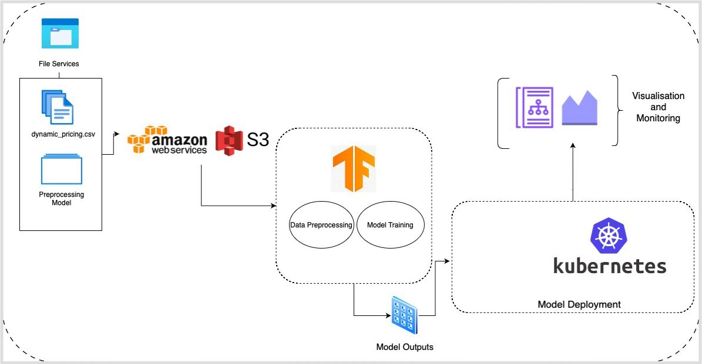

# Dynamic Pricing System for Ride-Sharing Services 🚗💸

An MLOps-enabled ML project that builds, deploys, and monitors a dynamic pricing model for ride-sharing, using real-time demand-supply signals to optimize fares.

## 📌 Table of Contents
- [Problem Statement](#problem-statement)
- [System Architecture](#system-architecture)
- [Features](#features)
- [Installation](#installation)
- [Usage](#usage)
- [Project Structure](#project-structure)
- [Model Pipeline](#model-pipeline)
- [Visualization & Monitoring](#visualization--monitoring)
- [Conclusion](#conclusion)
- [References](#references)

---

## Problem Statement
Dynamic pricing allows ride-sharing platforms to dynamically adjust ride costs based on fluctuating demand and supply. The aim is to reduce mismatch between riders and drivers, improve service reliability, and maximize profit while maintaining fairness.

---

## System Architecture



1. **Data Ingestion**: Historical ride data ingested and stored in AWS S3.
2. **Preprocessing**: Normalization, missing value imputation, outlier handling.
3. **Model Training**: Trained with Random Forest Regressor, evaluated with RMSE, MAE.
4. **Containerization**: Dockerized Flask app for consistent deployment.
5. **Deployment**: GCP + Kubernetes for load balancing and fault tolerance.
6. **Monitoring**: Plotly dashboards and system logs track accuracy and health.

---

## Features
- Real-time price prediction via ML model
- Elastic pricing via demand-supply multipliers
- Dockerized app for deployment
- Monitored using Plotly and Kubernetes UI
- Easy-to-use UI for input and price display

---

## Installation

```bash
git clone https://github.com/RahulVishal/MLOPs_project.git
cd MLOPs_project
python3 -m venv venv
source venv/bin/activate
pip install -r requirements.txt
```

To run locally:
```bash
python app.py
```

---

## Usage

- Navigate to the homepage
- Enter details: number of riders, drivers, vehicle type, expected duration
- Click **Predict** to see the estimated dynamic price


---

## Project Structure

```
MLOPs_project/
├── dynamic_pricing.csv         # Input dataset
├── model.pkl                   # Trained model
├── app.py                      # Flask app
├── Dockerfile                  # For containerization
├── templates/
│   ├── index.html
│   └── result.html
├── static/
│   └── style.css
├── images/                     # Report visuals
│   ├── devops_pipeline.png
│   ├── homepage.png
│   ├── result.png
│   └── accuracy_plot.png
└── requirements.txt
```

---

## Model Pipeline

- **Random Forest Regressor** used for ride price prediction.
- Handles non-linear relations with high accuracy (~93% R²).
- Input features:
  - Number_of_Riders
  - Number_of_Drivers
  - Vehicle_Type
  - Expected_Ride_Duration
- Demand and supply multipliers added to input features.


---

## Visualization & Monitoring

- **Plotly Dashboards** for:
  - Pricing trends
  - Actual vs predicted prices
  - System health metrics
- **Kubernetes UI**:
  - Replica scaling
  - Pod status
  - Resource usage

---

## Conclusion

This system combines the predictive power of ML with scalable DevOps principles to provide a reliable, responsive, and intelligent pricing engine for ride-sharing. With robust data preprocessing, containerized deployment, and real-time monitoring, it is ready for real-world integration.

---

## References

Full list of academic and technical references provided in the [report](./SkillLab_Report_AI045_AI040.docx).
